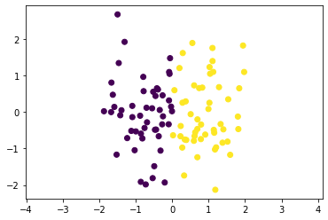
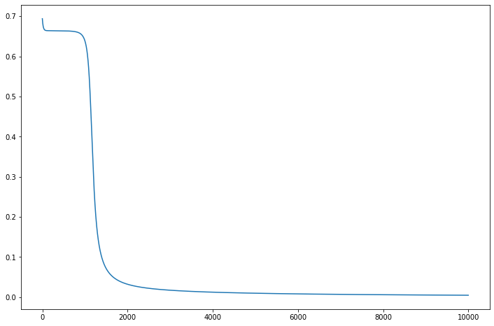

# A Simple Artificial Neural Network (ANN) from scratch
This is a simple project for deep learning. I developed a simple Neural Network with numpy liobrary only.

My code is quite similar to Keras of TensorFlow. So you can add method to build your own a difference ANN (Artifical Neural Network) structure and try it with your dataset.

# Notebook

To read more informations about 

### Folder tree:
```
|   ActivationFunction.py
|   ModelStructure.PNG
|   README.md
|   Sequential.py
|   SimpleNeuralNetwork.py
|   SimpleNNVietnhh.ipynb
|
\---__pycache__
```
# Libraries
- tqdm
- numpy
- matplotlib
- time

# Simple Neural Network
```
cd vietnhh
cd SimpleNeuralNetwork
python SinpleNeuralNetwork.py
```

# Model Structure

<p align="center">

</p>

# Dataset

We'll use 100 points 2D data showed in the iamge below:

<p align="center">

</p>

# Result

This is loss graph after each epochs in training phase:

<p align="center">

</p>

```
Accuracy Train =  1.0
Accuracy Test =  0.99
```

 Because we have very few in training set, so when you choose another seed, you should choose another hyper parameters like number epochs, learning rate, ... Or you can even change the neural network structure using "add" method or change the number of neural or activation function in this models.

